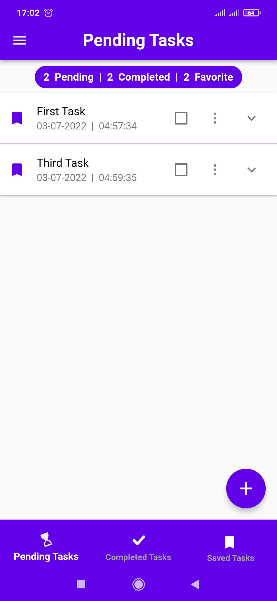

# ```To Do App```

| Home Page | Drawer | Add Tasks |
|----------------|:----------------:|:----------------:|
|  |  |  |

| Home Page | Home Page | Save Tasks |
|----------------|:----------------:|:----------------:|
|  |  |  |

| Save Tasks | Home Page | Saved Tasks |
|----------------|:----------------:|:----------------:|
|  |  |  |

| Saved Tasks | Home Page | Completed Tasks |
|----------------|:----------------:|:----------------:|
|  |  |  |

| Completed Tasks | Delete Task | Home Page |
|----------------|:----------------:|:----------------:|
|  |  |  |

| Drawer | Deleted Tasks | Deleted Tasks |
|----------------|:----------------:|:----------------:|
|  |  |  |

| Restore Task | Restored Task | Dark Mode |
|----------------|:----------------:|:----------------:|
|  |  |  |

| Pending Tasks | Completed Tasks | Saved Tasks |
|----------------|:----------------:|:----------------:|
|  |  |  |
